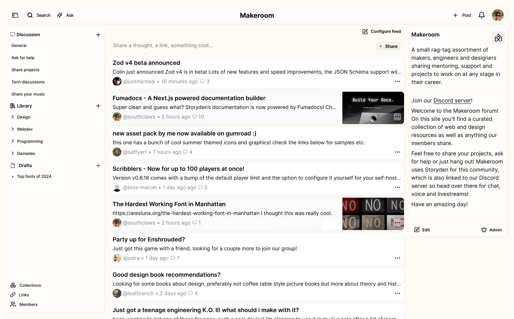

<p align="center">
  <a aria-label="storyden logo" href="https://storyden.org">
    
  </a>
</p>

<p align="center">
  <em>a modern community platform</em>
</p>

<p align="center">
  <a
    href="https://storyden.org/docs"
  >Documentation</a>
  |
  <a
    href="https://makeroom.club"
  >Friends</a>
</p>

<p align="center">
  With a fresh new take on traditional bulletin board web forum software,
  Storyden is a modern, secure and extensible platform for building communities.
</p>

# Storyden

Storyden is the platform for managing community and content, wherever they call home. Run a forum, a blog, post news, curate cool sites, build a directory, a knowledgebase and more. [Learn more here](https://www.storyden.org/docs/introduction/what-is-storyden).

If you'd like to help with some research, please fill in this tiny (anonymous) form: https://airtable.com/shrLY0jDp9CuXPB2X

You can try it right now! Run the image and open http://localhost:8000 in your browser:

```sh
docker run -p 8000:8000 ghcr.io/southclaws/storyden
```



## Releases and versions

Storyden releases tagged versions using a simple version number which applies to the product _as a whole_ not the API surface. For this reason, we do not use "semantic versioning" and breaking API changes are avoided as much as possible. Sometimes breaking changes may occur but these will always be documented and called out in release notes as well as in a separate list of just breaking changes.

```
  v1.25.8
   │ │  │
   │ │  └── Release: increments for every release in the year.
   │ └───── Year: releases happen frequently so we use a year marker for simplicity
   └─────── Major: will always be 1
```

This format was chosen for compatibility with package/app registries and developer expectations, but it does not follow semantic versioning, it's more of a "build number" similar to how video games are versioned.

Outside of a release commit/image, version numbers inside files and the API will be suffixed with `-canary` to indicate you're off a stable release.

## What can it do

> https://www.storyden.org/docs/introduction/what-is-storyden

Storyden is a modern forum, wiki and community hub. Like the internet forums of the past, but with a fresh coat of paint and modern security, deployment and intelligence features. A discussion forum, a Notion workspace and your own Reddit platform all rolled into one. Your community can use it for discussion, sharing links or building a directory of knowledge or structured data.

It's open source, [super easy to self host](https://www.storyden.org/docs/introduction/vps) and an homage to the 2000s internet!

## Why

> https://www.storyden.org/blog/building-running-administrating-modern-forum-software

The short version is: most forums are decades old, insecure, abandoned or just not pretty. Storyden aims to solve all of that with a modern language, simple deployment and beautiful design.

## Contributing

Contributions are very very welcome! ❤️ Until we get a proper guide set up, please open an issue if you have any questions!
